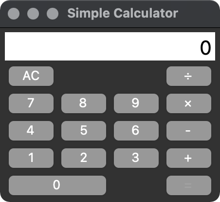

# Tkinter入門
## 8. 中間課題 見た目を完成させる
ここで，課題のGUIアプリケーションの見た目を完成させておきましょう．  
最終的な完成品は，以下のようなものになります．

サンプルプログラムは，穴あきの状態なので，ここまでで紹介した内容と，書いてあるプログラムを真似して見た目を完成させてみましょう．

まだボタンを押しても何も表示が変わりませんが，ここまでで一旦GUIが完成したことになります．以降はロジックの実装になります．