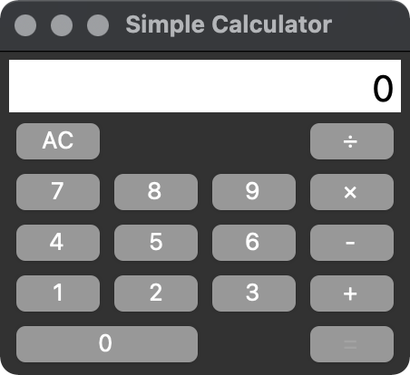

# WIP: PythonによるGUIアプリケーション開発入門
## 概要
Pythonによるプログラミング入門の一環として，Pythonによる簡易的なGUIアプリケーションの開発を行う．GUI作成部分に関しては，Pythonの標準ライブラリであるTkinterを用いる．

## はじめに
開発入門を始めるにあたって，関係する内容について軽く紹介する．なお，時間的な制約や学習難易度を考慮して，一部内容に関しては割愛，および具体的な説明はしないこととする．(気になった方は自分で調べてみてください)

### 用語解説
#### CUIとGUI
- キャラクタユーザインタフェース(Character User Interface)とは，主に文字や数字のみで構成された操作画面．中間課題(仮)で作成した対話式プログラムなどが相当．キーボードからの操作．

- グラフィカルユーザインターフェース(Graphical User Interface)とは，画像やボタンなどが配置された操作画面．一般的なパソコンのデスクトップなどが相当．マウスやタッチパネルなどの操作．

#### Tcl/Tk
本来，自作でGUIを作成するのは困難．それをとても簡単に作成できるようにした言語と，そのツールキットのがTcl/Tk

#### Tkinter
Tcl/Tkがとても使いやすいため，Pythonでも使えるようにしたのが，Tkinter．TkinterはPythonの標準ライブラリとして入っている(らしい)．

#### ライブラリ
いろいろなものを開発していると，異なるプロジェクトでも同じようなコードを使いまわしたくなる時がある．このようなコードを使い回しやすくして集めたものがライブラリ．

### WIP: 環境設定
(以下，メモ書き)
- dockerではまず動かない．そもそもGUI開発向きではないため，労力に合わない環境構築を強いることになる．
- python2.XだとTkinterの扱い方がところどころ違う．流石に今から2.X系を使った開発をすることはないとは思うものの，未だにMac標準のPythonは2.X系がインストールされているため注意
- Mac + pyenv + Tkinterだともしかしたら初回環境構築に苦戦するかもしれない．どうやら，MacとTcl/Tkの相性があまり良くないらしい．brewやpyenvでそのままビルドしたpythonと，リンクされているTcl/Tkのバージョンがうまく動かない組み合わせらしい．実際，私物のPCと社用PCで環境構築を行なったが，かなり手こずった．
- venvを使うとさらに難易度が上がる．標準ライブラリと言っているくらいなので，ここまでしなくてもいい気がしている．

### 課題(最終目標)
今回教材として作成するのは，簡単な四則演算が可能な計算機アプリケーション．

簡易的な仕様は以下の通り．
- 数字を押したらディスプレイに数字が表示される
- 二つの数字と演算子を入力したら計算結果がディスプレイに表示される
- ACボタンを押すことで状態をリセットできる

※ 時間の都合や，個人の習熟度によっては最終完成形まで到達できない可能性もあるため，段階的な課題を用意する予定．

## WIP: Tkinter入門 ~ 計算機のUI作成
(以下，メモ)
- Tkinterの説明を全くしないというわけにもいかないものの，あまり深掘りしても役に立たないので，程よい粒度で進めていきたい
- せいぜい各要素の説明と，とても簡単な使い方くらい
- Tkinter入門では，以下を想定．ロジックは全て次の章で実施予定．
    - テストコードの実行(一瞬)
    - ウィンドウの生成
    - frameの生成
    - 子frameの生成
    - labelの生成
    - labelの配置
    - buttonの生成
    - buttonの配置(gridについて)
    - buttonのイベントハンドリング

## WIP: 計算機のロジックの実装
(以下，メモ)
- 中間課題で，CUIバージョンの計算機プログラムは作る予定なので，そこまで困らないと予想
- 段階については，以下を想定
    - ボタンで入力した値をディスプレイに表示
    - 一つ目の値の取得
    - 二つ目の値の入力
    - 二つ目の値の取得
    - 計算結果をディスプレイに表示
    - ACボタン
- 最初は加算のみができるようにする．以降の追加課題は以下を想定
    - 四則演算に対応
    - 連打防止対応
    - その他(小数点，マイナス入力，UI改修など)

## 参考文献
特に役に立った文献を紹介．これら以外にもハマりどころや各種仕様について調べた時に用いた文献については，コードのコメントに載せている．
- [Kyoto University Research Information Repository: プログラミング演習 Python 2019](https://repository.kulib.kyoto-u.ac.jp/dspace/handle/2433/245698)
- [Tcl/Tk - Wikipedia](https://ja.wikipedia.org/wiki/Tcl/Tk)
- [Macのpyenv環境下でtkinterを使えるようにする方法 - Qiita](https://qiita.com/saki-engineering/items/92b7ec12ed07338929a3)
- [Unable to install tkinter with pyenv Pythons on MacOS - Stack Overflow](https://stackoverflow.com/questions/60469202/unable-to-install-tkinter-with-pyenv-pythons-on-macos)

## その他補足事項
- GitHubなどで公開してもよっぽど問題ないはず．
- 時間や習熟度の都合を念頭に置いて，複雑な文法や記法に関する言及はしないものとする
    - 辞書型
    - None型
    - その他いろいろ